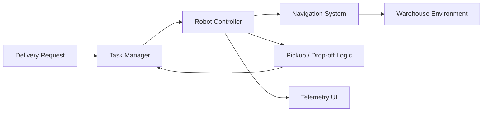

# Autonomous Warehouse Delivery Robot Simulation

A Unity simulation project focused on autonomous delivery inside a warehouse environment. The goal is to model how a robot can receive tasks, navigate to pickup points, deliver items, and report useful operational metrics.

## Project Status

In progress. This repository is intended to document the build as the Unity prototype develops, with screenshots, demo videos, scripts, and design notes added as features are completed.

## Project Goal

Warehouses rely on fast and predictable movement of goods between storage areas, packing stations, and dispatch points. This project simulates a small autonomous delivery robot that can move through a warehouse layout and complete delivery missions with minimal human input.

The project is designed as a robotics and simulation portfolio piece, showing both Unity development skills and the operational thinking behind warehouse automation.

## Core Features

- 3D warehouse environment with shelves, aisles, pickup points, and drop-off zones
- Autonomous robot movement between task locations
- Delivery task lifecycle: idle, assigned, moving to pickup, carrying item, delivering, completed
- Route handling using Unity navigation or waypoint systems
- Obstacle-aware movement behavior
- Simple UI telemetry for robot state, current task, distance, and delivery progress
- Metrics for delivery time, completed tasks, failed tasks, and route efficiency

## Technical Focus

- Unity scene design for warehouse simulation
- C# scripts for robot behavior and state management
- Task queue and delivery assignment logic
- Navigation logic using NavMesh, waypoints, or hybrid routing
- Runtime UI for debugging and portfolio presentation
- Clean project structure suitable for future expansion

## System Design



## Suggested Repository Structure

```text
Assets/
  Scenes/
    WarehouseSimulation.unity
  Scripts/
    Robot/
      RobotController.cs
      RobotStateMachine.cs
      RobotNavigation.cs
    Tasks/
      DeliveryTask.cs
      TaskManager.cs
    UI/
      TelemetryPanel.cs
  Prefabs/
    Robot.prefab
    Shelf.prefab
    PickupStation.prefab
    DropoffZone.prefab
  Materials/
  Art/
Docs/
  architecture.md
  screenshots/
README.md
```

## Planned Screenshots and Demo

Add these once the Unity scene is ready:

- Full warehouse layout
- Robot navigating an aisle
- Pickup task in progress
- Drop-off completion
- Telemetry UI during a delivery
- Short demo video or GIF

## Learning Outcomes

This project demonstrates:

- Building an interactive simulation in Unity
- Translating a real automation problem into system logic
- Creating clear robot states and task flows
- Designing portfolio documentation for a technical project
- Combining simulation, operations thinking, and software development

## Future Improvements

- Multi-robot task assignment
- Dynamic obstacle avoidance
- Battery level and charging station behavior
- Path cost optimization
- Warehouse congestion tracking
- Order priority handling
- Analytics dashboard for robot performance

## Author

Great Ukachukwu  
GitHub: https://github.com/Ug-tech  
LinkedIn: www.linkedin.com/in/great-ukachukwu-861b18192
